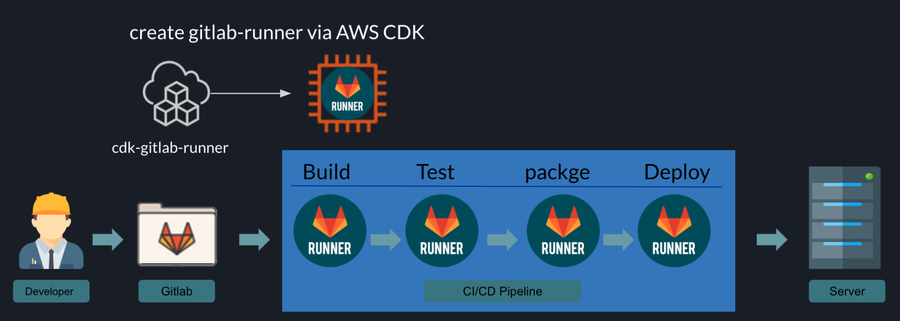

[](https://badge.fury.io/js/cdk-gitlab-runner)
[](https://badge.fury.io/py/cdk-gitlab-runner)


# Welcome to `cdk-gitlab-runner`
Use AWS CDK to create gitlab runner, and use [gitlab runner](https://gitlab.com/gitlab-org/gitlab-runner) to help you execute your Gitlab Pipeline Job.
> GitLab Runner is the open source project that is used to run your CI/CD jobs and send the results back to GitLab. [(source repo)](https://gitlab.com/gitlab-org/gitlab-runner)

## Why
Gitlab provides [400 minutes per month for each free user](https://about.gitlab.com/pricing/), hosted Gitlab Runner to execute your gitlab pipeline job.That's pretty good and users don't need to manage gitlab runner. If it is just a simple ci job for test 400, it may be enough.
But what if you want to deploy to your AWS production environment through pipeline job?
Is there any security consideration for using the hosted gitlab runner?!

But creating Gitlab Runner is not that simple, so I created this OSS so that you can quickly create Gitlab Runner and delete your Gitlab Runner via AWS CDK.
It will be used with AWS IAM Role, so you don't need to put AKSK in Gitlab environment variables.




## Note
### Default will help you generate below services:

- VPC
  - Public Subnet (2)
- EC2 (1 T3.micro)

## Before start you need gitlab runner token in your `gitlab project` or `gitlab group`

### In Group

Group > Settings > CI/CD


### In Project

Project > Settings > CI/CD > Runners


## Usage

Replace your gitlab runner token in `$GITLABTOKEN`

## Install
Use the npm dist tag to opt in CDKv1 or CDKv2:
```bash
// for CDKv2
npm install cdk-spot-one
or
npm install cdk-spot-one@latest

// for CDKv1
npm install cdk-spot-one@cdkv1 
```

### Instance Type

```typescript
import { GitlabContainerRunner } from 'cdk-gitlab-runner';

// If want change instance type to t3.large .
new GitlabContainerRunner(this, 'runner-instance', { gitlabtoken: '$GITLABTOKEN', ec2type:'t3.large' });
// OR
// Just create a gitlab runner , by default instance type is t3.micro .
import { GitlabContainerRunner } from 'cdk-gitlab-runner';

new GitlabContainerRunner(this, 'runner-instance', { gitlabtoken: '$GITLABTOKEN' });})
```

### Gitlab Server Customize Url .

If you want change what you want tag name .

```typescript
// If you want change  what  your self Gitlab Server Url .
import { GitlabContainerRunner } from 'cdk-gitlab-runner';

new GitlabContainerRunner(this, 'runner-instance-change-tag', {
  gitlabtoken: '$GITLABTOKEN',
  gitlaburl: 'https://gitlab.my.com/',
});
```

### Tags

If you want change what you want tag name .

```typescript
// If you want change  what  you want tag name .
import { GitlabContainerRunner } from 'cdk-gitlab-runner';

new GitlabContainerRunner(this, 'runner-instance-change-tag', {
  gitlabtoken: '$GITLABTOKEN',
  tags: ['aa', 'bb', 'cc'],
});
```

### IAM Policy

If you want add runner other IAM Policy like s3-readonly-access.

```typescript
// If you want add runner other IAM Policy like s3-readonly-access.
import { GitlabContainerRunner } from 'cdk-gitlab-runner';
import { ManagedPolicy } from '@aws-cdk/aws-iam';

const runner = new GitlabContainerRunner(this, 'runner-instance-add-policy', {
  gitlabtoken: '$GITLABTOKEN',
  tags: ['aa', 'bb', 'cc'],
});
runner.runnerRole.addManagedPolicy(
  ManagedPolicy.fromAwsManagedPolicyName('AmazonS3ReadOnlyAccess'),
);
```

### Security Group

If you want add runner other SG Ingress .

```typescript
// If you want add runner other SG Ingress .
import { GitlabContainerRunner } from 'cdk-gitlab-runner';
import { Port, Peer } from '@aws-cdk/aws-ec2';

const runner = new GitlabContainerRunner(this, 'runner-add-SG-ingress', {
  gitlabtoken: 'GITLABTOKEN',
  tags: ['aa', 'bb', 'cc'],
});

// you can add ingress in your runner SG .
runner.defaultRunnerSG.connections.allowFrom(
  Peer.ipv4('0.0.0.0/0'),
  Port.tcp(80),
);
```

### Use self VPC

> 2020/06/27 , you can use your self exist VPC or new VPC , but please check your `vpc public Subnet` Auto-assign public IPv4 address must be Yes ,or `vpc private Subnet` route table associated `nat gateway` .

```typescript
import { GitlabContainerRunner } from 'cdk-gitlab-runner';
import { Port, Peer, Vpc, SubnetType } from '@aws-cdk/aws-ec2';
import { ManagedPolicy } from '@aws-cdk/aws-iam';

const newvpc = new Vpc(stack, 'VPC', {
  cidr: '10.1.0.0/16',
  maxAzs: 2,
  subnetConfiguration: [
    {
      cidrMask: 26,
      name: 'RunnerVPC',
      subnetType: SubnetType.PUBLIC,
    },
  ],
  natGateways: 0,
});

const runner = new GitlabContainerRunner(this, 'testing', {
  gitlabtoken: '$GITLABTOKEN',
  ec2type: 't3.small',
  selfvpc: newvpc,
});
```

### Use your self exist role

> 2020/06/27 , you can use your self exist role assign to runner

```typescript
import { GitlabContainerRunner } from 'cdk-gitlab-runner';
import { Port, Peer } from '@aws-cdk/aws-ec2';
import { ManagedPolicy, Role, ServicePrincipal } from '@aws-cdk/aws-iam';

const role = new Role(this, 'runner-role', {
  assumedBy: new ServicePrincipal('ec2.amazonaws.com'),
  description: 'For Gitlab EC2 Runner Test Role',
  roleName: 'TestRole',
});

const runner = new GitlabContainerRunner(stack, 'testing', {
  gitlabtoken: '$GITLAB_TOKEN',
  ec2iamrole: role,
});
runner.runnerRole.addManagedPolicy(
  ManagedPolicy.fromAwsManagedPolicyName('AmazonS3ReadOnlyAccess'),
);
```

### Custom Gitlab Runner EBS szie

> 2020/08/22 , you can change you want ebs size.

```typescript
import { GitlabContainerRunner } from 'cdk-gitlab-runner';

new GitlabContainerRunner(stack, 'testing', {
  gitlabtoken: '$GITLAB_TOKEN',
  ebsSize: 50,
});
```

### Control the number of runners with AutoScalingGroup

> 2020/11/25 , you can set the number of runners.

```typescript
import { GitlabRunnerAutoscaling } from 'cdk-gitlab-runner';

new GitlabRunnerAutoscaling(stack, 'testing', {
  gitlabToken: '$GITLAB_TOKEN',
  minCapacity: 2,
  maxCapacity: 2,
});
```

### Support Spotfleet Gitlab Runner

> 2020/08/27 , you can use spotfleet instance be your gitlab runner,
> after create spotfleet instance will auto output instance id.

```typescript
import { GitlabContainerRunner, BlockDuration } from 'cdk-gitlab-runner';

const runner = new GitlabContainerRunner(stack, 'testing', {
  gitlabtoken: 'GITLAB_TOKEN',
  ec2type: 't3.large',
  blockDuration: BlockDuration.ONE_HOUR,
  spotFleet: true,
});
// configure the expiration after 1 hours
runner.expireAfter(Duration.hours(1));
```

> 2020/11/19, you setting job runtime bind host volumes.
> see more https://docs.gitlab.com/runner/configuration/advanced-configuration.html#the-runnersdocker-section

```typescript
import { GitlabContainerRunner, BlockDuration } from 'cdk-gitlab-runner';

const runner = new GitlabContainerRunner(stack, 'testing', {
  gitlabtoken: 'GITLAB_TOKEN',
  ec2type: 't3.large',
  dockerVolumes: [
    {
      hostPath: '/tmp/cache',
      containerPath: '/tmp/cache',
    },
  ],
});
```

## Wait about 6 mins , If success you will see your runner in that page .


#### you can use tag `gitlab` , `runner` , `awscdk` ,

## Example _`gitlab-ci.yaml`_

[gitlab docs see more ...](https://docs.gitlab.com/ee/ci/yaml/README.html)

```yaml
dockerjob:
  image: docker:18.09-dind
  variables:
  tags:
    - runner
    - awscdk
    - gitlab
  variables:
    DOCKER_TLS_CERTDIR: ""
  before_script:
    - docker info
  script:
    - docker info;
    - echo 'test 123';
    - echo 'hello world 1228'
```

### If your want to debug you can go to aws console

# `In your runner region !!!`

## AWS Systems Manager > Session Manager > Start a session


#### click your `runner` and click `start session`

#### in the brower console in put `bash`

```bash
# become to root
sudo -i

# list runner container .
root# docker ps -a

# modify gitlab-runner/config.toml

root# cd /home/ec2-user/.gitlab-runner/ && ls
config.toml

```


## :clap:  Supporters
[](https://github.com/neilkuan/cdk-gitlab-runner/stargazers)
